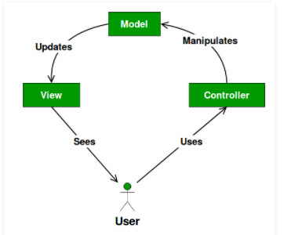
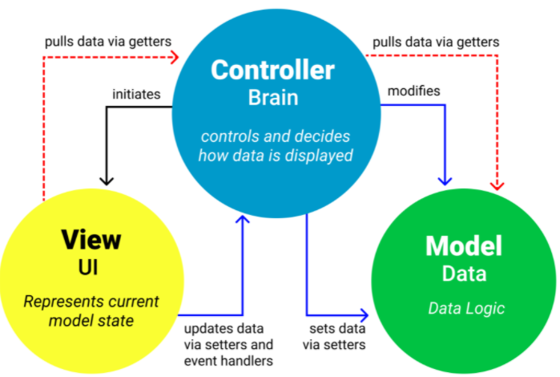

## What is MVC & how does it work

MVC design pattern introduces another abstraction layer that will help with the software planning, and also allow new programmers to navigate even in a bigger codebase. By splitting the thinking process into data, interface, and decisions, developers can reduce the number of source files that must be searched in order to add or fix functionality.

This design pattern separates code into three layers as the name suggests. 

- Model
    - job: stores game map, player and NPC data, game settings. Everything data.
    - is not aware of what Views or Controllers are looking at it.
    - can post and listen for events.
- View
    - job: draws on screen what the model represents.
    - is strongly aware of the model and its values.
    - can post and listen for events.
- Controller
    - job: taking keyboard and mouse input and posts matching events.
    - is strongly aware of the model and its values.
    - can post and listen for events.
- Events
    - job: coordinates messages between listeners.

This shows that even if the Controller does not know anything about the player's health, what level we are on, it still only catches key presses and sends out events to match.

Nor does the View care how the player is controlling our game. The View only cares about showing on screen the current model state. Since the View also listens to posted events, it will pick up mouse clicks and key presses that integrate into its widgets.
