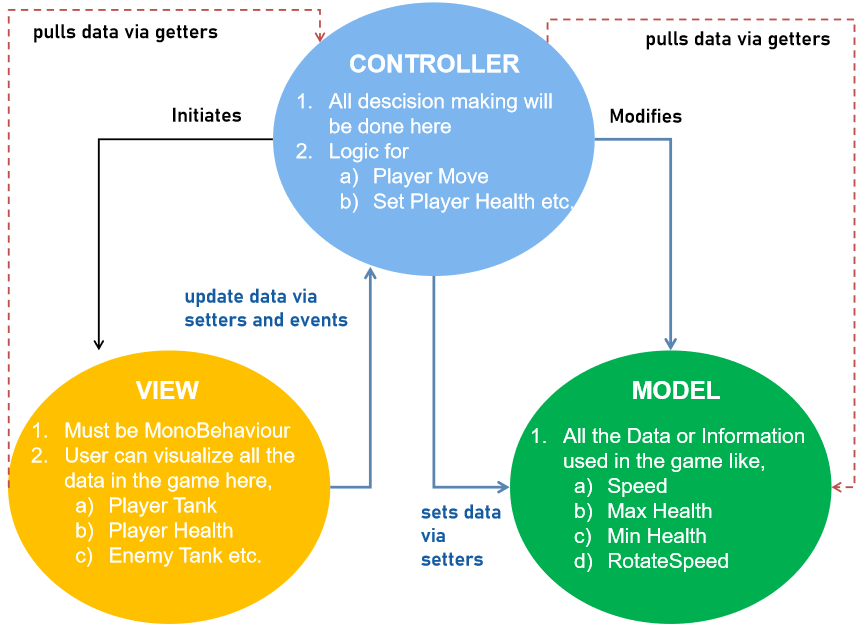

##  Implementation Example of MVC in Real Game Development

### Game Example: Battle Tank

#### Objective: Move the player tank across the map with the help of keyboard/touch inputs
Below we will show you how to make out tank move across the map with the help of MVC Implementation:

Before Jumping on to the game code example, We would like to revise the concepts of MVC via the below snippet:



Let’s Begin with the code implementation starting by writing the logic for the movement in Controller script,

### Controller
1. It will be responsible for storing the business logic for moving the tank
2. It will also contain the references of Model and View so that the program of the player tank can easily communicate with each other


```C#
Using UnityEngine;

namespace PlayerTankService
{
	public class Controller
	{
		public Model model {get; set;}
		public View view {get; set;}

		public void TankMovement(){
			//code for adjusting the position of tank and moving forward and backward.
		}
		public void TankRotate(){
			//code for adjusting the rotation of tank upto 360 degrees.
		}
	}
}
```

In the above we can observe the following:
1. Getter and Setter methods of Tank Model and Tank View script will be called in this script
2. The logic for moving and rotating the tank (to certain degrees) is given here.

### View
1. TankView will always be a MonoBehavior class.
2. This script will have all the details about all the visible components in our game system like tanks, bullets, enemies, random power Ups, collectables, etc.

```C#
using UnityEngine;

namespace PlayerTankService{
	public class View : Monobehaviour{
	
		public Controller controller;
		
		private void FixedUpdate(){
			controller.TankMovement(); //calling the methods here via the controller script.
			controller.TankRotate();
		}
	}
}
```

In the above we can observe the following:

1. Reference of Controller is given here
2. Tank movement logic which was defined in the controller and the same functions are called in the View script’s FixedUpdate (for Physics Calculations) as it is the only class with MonoBehaviour

### Model
1. It will contain all the data variables that our Tank might need such as health, speed, colour, Turn speed of our Tank, etc.

```C#
using UnityEngine;

namespace PlayerTankService{
	public class Model{
	
		public Controller controller;
		
		public Model(){
			
			//All the necessary data variables are used to move and rotate the PlayerTankService.
			//For Example -
			//Speed = 50f;
			//Maxhealth = 100f;
		}
	}
}
```

In the above we can observe the following:

1. Data components included that will be used by our PlayerTank
2. All the components are declared with a getter and setter here to be used in other scripts
